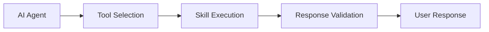

# Skills & Tool Calls

Skills are custom JavaScript functions that extend your AI agent's capabilities. When deployed, they become available as tools that the AI can invoke during conversations.

## Architecture

### Tool Call Flow

1. **Tool Discovery**: AI agent analyzes available skills and their parameters
2. **Parameter Extraction**: Agent extracts relevant data from conversation context
3. **Skill Invocation**: Platform executes the skill with provided parameters
4. **Response Processing**: Output is validated and formatted for the user
5. **Context Integration**: Results are integrated back into the conversation

### When Skills Are Called

- User requests specific actions ("book a meeting", "check inventory")
- AI determines contextual actions are needed
- Explicit button/carousel interactions trigger specific skills
- Scheduled or event-driven executions (future capability)

---

## Skill Types

### **Informational Skills**

Fetch and present data without side effects.

**Examples:** Weather lookup, stock prices, knowledge base search

### **Action Skills**

Perform operations that change external state.

**Examples:** Create calendar events, send emails, update CRM records

### **Interactive Skills**

Present UI elements for continued user interaction.

**Examples:** Multi-step forms, approval workflows, guided tutorials

---

## Tool Call Context

When a skill executes, it receives rich context about the conversation:

- **Conversation Metadata**: ID, participant info, channel type
- **Organization Context**: Settings, timezone, custom fields
- **Message History**: Recent messages for context-aware responses
- **User Profile**: Contact information and preferences

This context enables skills to provide personalized, relevant responses.

<Card title="Developement" icon="sparkles" href="/actions/development">
  
</Card>